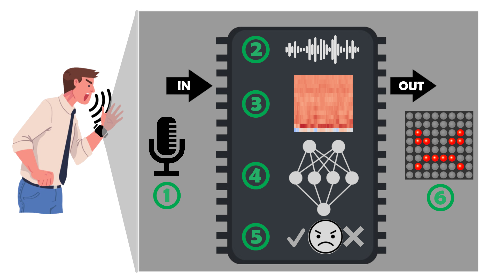
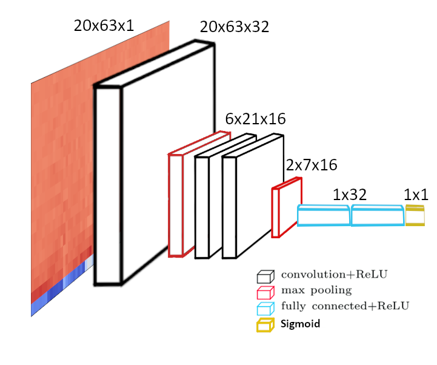

# Compact Anger Detection Device Using Real-Time Voice Analysis

This project presents the development of a compact device designed to detect the emotion of anger through real-time voice analysis.

Creating a compact solution comes with challenges, particularly due to the computational and storage limitations of small processors. While previous research has achieved high accuracy (up to 95%) in emotion detection using large-scale neural network architectures with millions of parameters, such solutions are impractical for hardware with limited resources.

To address this, a reduced-size neural network based on the VGG16 architecture was designed. Using TensorFlow Lite, the network was compressed, reducing the total number of parameters to the order of **1×10³** while maintaining an accuracy of approximately **80%**. The neural network was trained with mel-frequency cepstral coefficients (MFCC) derived from the Emotional Speech Database (ESD).

The implementation was carried out on an **ESP32-WROVER-E microcontroller**, featuring:
- **Audio sample collection** via a microphone.
- **Real-time computation of MFCC.**
- **Inference** using the compressed neural network.
- **Visualization of results** on an LED matrix indicating the presence or absence of anger.

The system achieves a total processing time of **676.41 milliseconds** after capturing audio samples, demonstrating its viability for real-time applications.

<p align="center">
</p>

## Audio Analysis

The audio analysis process in this project extracts **Mel-Frequency Cepstral Coefficients (MFCCs)**, which are widely used in speech and audio processing due to their ability to represent the perceptual aspects of human hearing. Below is a summary of the key steps involved:

### 1. Pre-emphasis
A pre-emphasis filter is applied to the audio signal to amplify high frequencies, compensating for the natural attenuation present in speech, especially in vowels and nasals. This step improves sound detection and phoneme identification.

### 2. Framing and Windowing
The audio signal is divided into overlapping frames using the **Hamming window** to preserve signal continuity at the edges. Each frame is analyzed to capture its frequency content over time.

### 3. Spectrogram and Fast Fourier Transform (FFT)
The **spectrogram** is computed by applying the Fast Fourier Transform (FFT) to each windowed frame. This reveals the frequency distribution of the signal over time.

### 4. Mel Scale and Triangular Filters
To better mimic human auditory perception, the frequencies are mapped to the **Mel scale**, which gives higher resolution to lower frequencies. A bank of **triangular filters** is applied to the spectrogram to emphasize frequencies within the human vocal range (20 Hz to 2,048 Hz in this project).

### 5. Logarithmic Transformation
The output of the triangular filters is converted to the logarithmic scale to align with how humans perceive loudness.

### 6. Discrete Cosine Transform (DCT)
Finally, a **Discrete Cosine Transform (DCT)** is applied to decorrelate the frequency components and extract the most relevant features. The result is a set of MFCCs that represent the audio signal efficiently.

### MFCC Extraction Pipeline
The following summarizes the full pipeline:
1. Apply pre-emphasis.
2. Segment the signal into frames using the Hamming window.
3. Compute the spectrogram using FFT.
4. Map the spectrogram to the Mel scale with triangular filters.
5. Apply logarithmic transformation.
6. Perform DCT to extract MFCCs.

The resulting MFCCs serve as input to the neural network for emotion detection, providing a compact and meaningful representation of the audio signal.

## Model: miniVGG16

The AI model developed for this project, named **miniVGG16**, is a custom adaptation of the VGG16 architecture. This choice was based on the simplicity and effectiveness of the original architecture, with significant modifications to meet the resource constraints of the ESP32-WROVER-E microcontroller.

### Key Features
- **Parameter Reduction:**  
  - The original VGG16 architecture contains 138 million parameters.  
  - In contrast, miniVGG16 includes only **15,553 parameters**, optimized to fit within the 4MB PSRAM of the ESP32-WROVER-E.  

- **Optimized Input:**  
  - Instead of VGG16’s standard input size (224×224 pixels with 3 channels), miniVGG16 uses an input size of **20×63 pixels in a single channel**, derived from MFCC features calculated from audio data.  

- **Architecture Overview:**  
  1. **Initial Layer:** Input of size 20×63 followed by a convolutional layer (ReLU activation) producing an output of 20×63×32.  
  2. **Convolutional Stage:** Two additional convolutional layers and two max pooling layers, ending with an output size of 2×7×16.  
  3. **Classification Stage:** Two fully connected layers (32 neurons each, ReLU activation, and dropout).  
  4. **Output Layer:** A sigmoid layer producing a single value between 0 and 1, representing the probability of anger detection.  

<p align="center">
</p>

- **Training Hyperparameters:**  
  - **Learning rate:** `0.00047`  
  - **Optimizer:** `Adam`  
  - **Epochs:** `250`  
  - **Batch size:** `490`  
  - **Loss function:** `Binary Crossentropy`  
  - **Metric:** `Accuracy`

The model was trained using Keras and subsequently compressed using TensorFlow Lite for efficient execution on the microcontroller.

### Model Performance
The model achieves an accuracy of **80%**, which is sufficient for real-time anger detection, with a total processing time of **676.41 ms**, including audio acquisition and analysis.

## Requirements

This project requires the following dependencies:

- **Python 3.8**: Ensure that Python version 3.8 is installed.
- **TensorFlow 2.11.0**: Deep learning library for model training and inference.  
  - Install with `pip install tensorflow==2.11.0`.
- **CUDA Toolkit**: Necessary for GPU acceleration.  
  - Tested with **CUDA 11.x**. Ensure that your GPU and drivers are compatible with this version.
- **cuDNN**: Deep neural network library for CUDA acceleration.  
  - Required version: **8.x**, compatible with TensorFlow 2.11.0.
- **Jupyter Notebook**: For running and testing the code interactively.  
  - Install with `pip install notebook`.
- **NumPy**: For numerical operations.  
  - Install with `pip install numpy`.

### Setting Up CUDA for GPU Support

To enable GPU support for TensorFlow, make sure you have the following installed:

1. **NVIDIA GPU Driver**: Install the appropriate driver for your GPU. Check compatibility with the [NVIDIA driver download page](https://www.nvidia.com/Download/index.aspx).  
2. **CUDA Toolkit 11.x**: Download and install the CUDA Toolkit from the [NVIDIA Developer website](https://developer.nvidia.com/cuda-downloads).  
3. **cuDNN 8.x**: Install the cuDNN library by following the instructions on the [NVIDIA cuDNN page](https://developer.nvidia.com/cudnn).

Verify your setup by running the following command in Python:
```python
import tensorflow as tf
print("Num GPUs Available: ", len(tf.config.experimental.list_physical_devices('GPU')))
